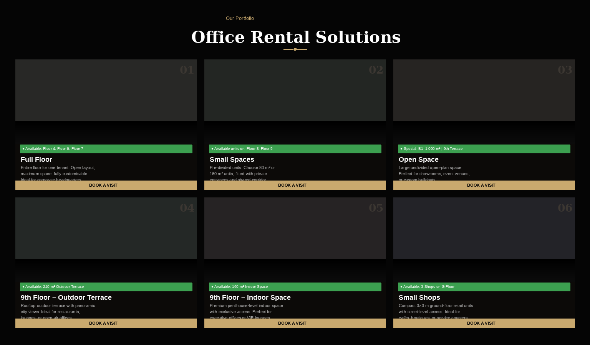
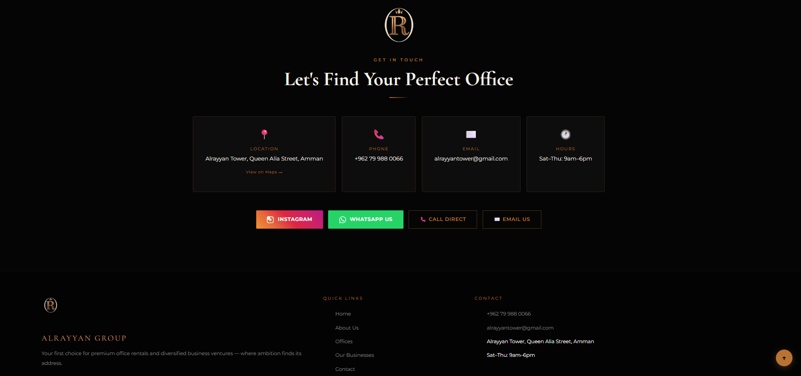
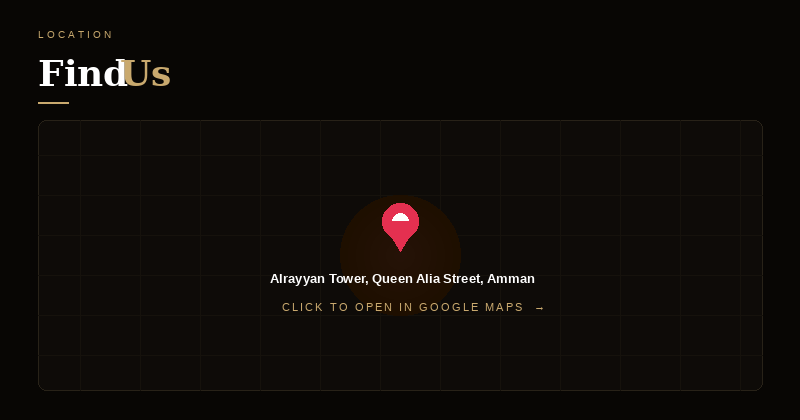

# Alrayyan Group Website

[](https://alrayyanjo.com)
[](https://firebase.google.com/)
[](https://developer.mozilla.org/en-US/docs/Web/JavaScript)

Bilingual (English / Arabic) Firebase-hosted business website for **Alrayyan Tower** — a commercial real estate complex in Amman, Jordan. Presents four business verticals with a public storefront, a Firestore-backed booking system, and a protected admin panel.

**🌐 Live:** [alrayyanjo.com](https://alrayyanjo.com)

## Screenshots

### Homepage Hero


### Office Listings


### Contact Section


### Booking Form


### Location Map


> Visit [alrayyanjo.com](https://alrayyanjo.com) for the live experience.

## Key Features

- **Bilingual EN / AR** — full site content and layout in both languages
- **Firestore Booking System** — visitors submit visit requests per listing, managed in real time
- **Admin Panel** — protected dashboard for reviewing, approving, or rejecting bookings
- **Four Business Verticals** — office floors, arts, fashion, and land listings
- **Automated Email Notifications** — Firebase Cloud Functions + Nodemailer send confirmations and status updates

## Tech Stack

Vanilla HTML / CSS / JS · Firebase Hosting · Cloud Firestore · Firebase Cloud Functions (Node.js) · Nodemailer (Gmail SMTP)

## Business Verticals

| Section | Description |
|---|---|
| Office Spaces | Floor listings with availability and booking |
| Arts | Paintings & sculptures gallery |
| Fashion | Clothing and accessories |
| Land | Investment plots for sale |

## Architecture

```
Firebase Hosting (static files)
├── HTML/CSS/JS pages (bilingual)
├── js/firebase-config.js     → Firestore + Auth init
└── Cloud Functions (Node.js)
    ├── onBookingCreated      → email admin on new booking
    └── onBookingStatusChanged→ email customer on approve/reject
```

## Setup / Run

```bash
git clone https://github.com/omaralrayyan7/alrayyan.git
cd alrayyan
npx serve .   # static preview (no Firebase features)

# Full setup with Firebase features:
cd functions && npm install
firebase deploy --only functions
```

You'll need your own Firebase project config in `js/firebase-config.js`.

## License

[MIT](LICENSE)
