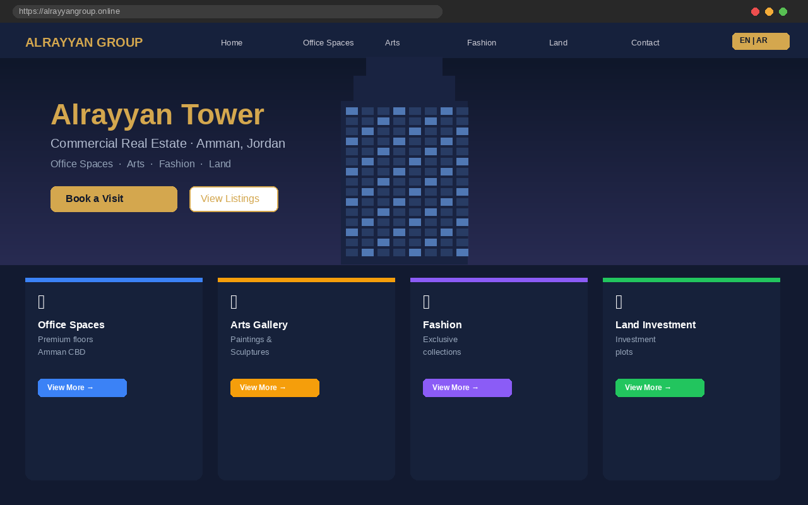

# Alrayyan Group Website

**Live site:** [alrayyangroup.online](https://alrayyangroup.online)

A bilingual (English/Arabic), Firebase-hosted business website for **Alrayyan Tower** — a commercial real estate complex in Amman, Jordan. The site presents four business verticals — **office spaces** (floor listings), **arts** (paintings & sculptures), **fashion**, and **land** (investment plots) — with a public storefront, a Firestore-backed visit/booking system, and a protected admin panel for reviewing and approving bookings.


<!-- Replace docs/screenshot.png with an actual screenshot of the homepage -->

## Key Features

- **Bilingual EN/AR** — full site content and layout in English and Arabic
- **Firestore booking system** — visitors submit visit requests per listing, stored and managed in real time via Cloud Firestore
- **Admin panel** — protected dashboard (`mgmt-panel.html`) for reviewing, approving, or rejecting bookings
- **Four business verticals** — office floors, arts, fashion, and land listings, each with dedicated detail pages
- **Automated email notifications** — Firebase Cloud Functions + Nodemailer send booking confirmations and status updates

## Tech Stack

Vanilla HTML/CSS/JS · Firebase Hosting · Cloud Firestore · Firebase Cloud Functions (Node.js) · Nodemailer (Gmail SMTP)

## Key Code Segments

### Firebase Initialisation (`js/firebase-config.js`)
Sets up the Firestore client and exposes `window.db` for all pages to use.

```js
firebase.initializeApp(firebaseConfig);
window.db = firebase.firestore();
window.auth = firebase.auth();
window.ADMIN_WHATSAPP = '962799880066';
```

### Cloud Function — New Booking Notification (`functions/index.js`)
Triggered on every new Firestore booking document; sends an admin email with a link to the admin panel.

```js
exports.onBookingCreated = onDocumentCreated("bookings/{bookingId}", async (event) => {
  const b = event.data.data();
  const transporter = buildTransporter();
  await transporter.sendMail({
    from: GMAIL_EMAIL.value(),
    to: ADMIN_EMAIL.value(),
    subject: `New Booking – ${b.visitor_name}`,
    html: adminEmailHtml(b),
  });
});
```

### Cloud Function — Booking Status Change (`functions/index.js`)
Sends approval or rejection email to the customer when the admin updates a booking's status.

```js
exports.onBookingStatusChanged = onDocumentUpdated("bookings/{bookingId}", async (event) => {
  const after = event.data.after.data();
  if (after.status === "confirmed") {
    await transporter.sendMail({ to: after.email, html: customerApprovedHtml(after) });
  } else if (after.status === "rejected") {
    await transporter.sendMail({ to: after.email, html: customerRejectedHtml(after) });
  }
});
```

## Setup / Run

```bash
git clone https://github.com/omaralrayyan7/alrayyan.git
cd alrayyan

# Serve statically (no build step)
npx serve .

# Cloud Functions (optional, requires Firebase CLI + your own Firebase project)
cd functions
npm install
firebase deploy --only functions
```

You'll need your own Firebase project config in `js/firebase-config.js` and Firestore security rules from `firestore.rules` to run the booking/admin features end-to-end.

## Live Link

[alrayyangroup.online](https://alrayyangroup.online)
